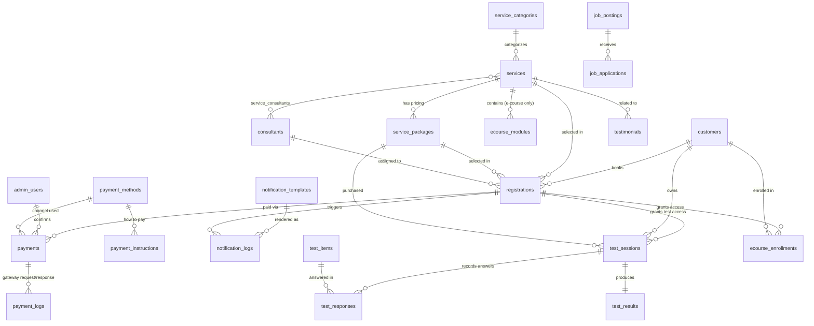

# Entity Relationship Design (ERD)
## TheAIM Digital Platform — PostgreSQL Schema

| | |
|---|---|
| **Database Engine** | PostgreSQL 15+ |
| **Primary Key Strategy** | `bigserial` (sequential, no UUID) |
| **Categorical Fields** | `varchar` + `CHECK` constraint (no native `ENUM` types, for easier ALTER/migration at scale) |
| **Indexing Strategy** | B-Tree on FKs/status/lookup fields, composite indexes for filtered listings, partial indexes for hot operational queues, BRIN on large append-only time-series tables |
| **Companion Documents** | `prd.md`, `trd.md` |

---

## 1. Entity Overview

| Domain | Tables |
|---|---|
| Catalog & Pricing | `service_categories`, `services`, `service_packages`, `consultants`, `service_consultants` |
| Customer & Booking | `customers`, `registrations`, `payments` |
| Payment Infrastructure & Notifications | `payment_methods`, `payment_instructions`, `payment_logs`, `notification_templates`, `notification_logs` |
| **Psychometric Test Engine** | **`test_sessions`, `test_items`, `test_responses`, `test_results`** |
| Corporate / Partnership | `corporate_inquiries`, `partnership_submissions`, `proposal_download_leads` |
| Recruitment | `job_postings`, `job_applications` |
| Content & Marketing | `articles`, `testimonials`, `corporate_partners` |
| Digital Product | `ecourse_modules`, `ecourse_enrollments` |
| Internal | `admin_users` |

> **Note on source consolidation:** a prior payment/notification gateway project (`nebeng.sql`) contributed the `payment_methods`, `payment_instructions`, `payment_logs`, `notification_templates`, and `notification_logs` tables below, generalized from a donation-platform context into TheAIM's service-registration context. Its standalone `admins` table was **not** reintroduced — it is intentionally consolidated into the `admin_users` table already defined in section 8, so TheAIM has a single staff-account table rather than two competing ones.

## 2. Mermaid Entity Relationship Diagram



---

## 3. DDL — Catalog & Pricing

```sql
CREATE TABLE service_categories (
    id              bigserial PRIMARY KEY,
    name            varchar(100) NOT NULL,
    slug            varchar(120) NOT NULL,
    description     text,
    display_order   integer NOT NULL DEFAULT 0,
    created_at      timestamptz NOT NULL DEFAULT now(),
    updated_at      timestamptz NOT NULL DEFAULT now(),
    CONSTRAINT uq_service_categories_slug UNIQUE (slug)
);
CREATE INDEX idx_service_categories_display_order ON service_categories (display_order);


CREATE TABLE services (
    id                  bigserial PRIMARY KEY,
    category_id         bigint NOT NULL REFERENCES service_categories(id) ON DELETE RESTRICT,
    name                varchar(150) NOT NULL,
    slug                varchar(160) NOT NULL,
    short_description    varchar(255),
    description         text,
    delivery_mode       varchar(20) NOT NULL DEFAULT 'hybrid',
    audience_type       varchar(20) NOT NULL DEFAULT 'individual',
    is_featured         boolean NOT NULL DEFAULT false,
    status              varchar(20) NOT NULL DEFAULT 'published',
    created_at          timestamptz NOT NULL DEFAULT now(),
    updated_at          timestamptz NOT NULL DEFAULT now(),
    CONSTRAINT uq_services_slug UNIQUE (slug),
    CONSTRAINT ck_services_delivery_mode CHECK (delivery_mode IN ('online','offline','hybrid')),
    CONSTRAINT ck_services_audience_type CHECK (audience_type IN ('individual','corporate','both')),
    CONSTRAINT ck_services_status CHECK (status IN ('draft','published','archived'))
);
-- High-traffic public catalog listing: filter by category + status, ordered for display
CREATE INDEX idx_services_category_status ON services (category_id, status);
CREATE INDEX idx_services_status_featured ON services (status, is_featured) WHERE status = 'published';


CREATE TABLE service_packages (
    id              bigserial PRIMARY KEY,
    service_id      bigint NOT NULL REFERENCES services(id) ON DELETE CASCADE,
    test_code       varchar(50),                 -- e.g. 'ENNEAGRAM', 'DISC', 'MBTI' for standalone psychometric tests
    name            varchar(150) NOT NULL,        -- e.g. 'Assessment Only', 'Individual Session', 'Akses Tes'
    price_type      varchar(20) NOT NULL DEFAULT 'fixed',
    price_amount    numeric(12,2),                 -- used when price_type = 'fixed'
    price_min       numeric(12,2),                 -- used when price_type = 'range'
    price_max       numeric(12,2),                 -- used when price_type = 'range'
    price_unit      varchar(30) DEFAULT 'per_session',
    features        jsonb NOT NULL DEFAULT '[]',  -- bullet list of inclusions, e.g. ["Full Assessment TM","Handout Hasil Lengkap"]
    is_popular       boolean NOT NULL DEFAULT false,
    status          varchar(20) NOT NULL DEFAULT 'active',
    created_at      timestamptz NOT NULL DEFAULT now(),
    updated_at      timestamptz NOT NULL DEFAULT now(),
    CONSTRAINT ck_service_packages_price_type CHECK (price_type IN ('fixed','range','negotiable')),
    CONSTRAINT ck_service_packages_price_unit CHECK (price_unit IN ('per_session','per_day','per_pax','per_access','per_hour')),
    CONSTRAINT ck_service_packages_status CHECK (status IN ('active','inactive')),
    CONSTRAINT ck_service_packages_price_logic CHECK (
        (price_type = 'fixed'  AND price_amount IS NOT NULL) OR
        (price_type = 'range'  AND price_min IS NOT NULL AND price_max IS NOT NULL) OR
        (price_type = 'negotiable')
    )
);
CREATE INDEX idx_service_packages_service_id ON service_packages (service_id);
CREATE INDEX idx_service_packages_test_code ON service_packages (test_code) WHERE test_code IS NOT NULL;
CREATE INDEX idx_service_packages_features_gin ON service_packages USING gin (features);


CREATE TABLE consultants (
    id              bigserial PRIMARY KEY,
    full_name       varchar(150) NOT NULL,
    role_title      varchar(100) NOT NULL,      -- e.g. 'Psikolog Klinis', 'Certified Financial Planner'
    specialization  varchar(255),
    certification   varchar(255),
    bio             text,
    photo_url       varchar(255),
    status          varchar(20) NOT NULL DEFAULT 'active',
    created_at      timestamptz NOT NULL DEFAULT now(),
    updated_at      timestamptz NOT NULL DEFAULT now(),
    CONSTRAINT ck_consultants_status CHECK (status IN ('active','inactive'))
);
CREATE INDEX idx_consultants_status ON consultants (status);


CREATE TABLE service_consultants (
    id              bigserial PRIMARY KEY,
    service_id      bigint NOT NULL REFERENCES services(id) ON DELETE CASCADE,
    consultant_id   bigint NOT NULL REFERENCES consultants(id) ON DELETE CASCADE,
    created_at      timestamptz NOT NULL DEFAULT now(),
    CONSTRAINT uq_service_consultants UNIQUE (service_id, consultant_id)
);
CREATE INDEX idx_service_consultants_consultant_id ON service_consultants (consultant_id);
```

## 4. DDL — Customers & Booking

```sql
CREATE TABLE customers (
    id              bigserial PRIMARY KEY,
    full_name       varchar(150) NOT NULL,
    whatsapp_number varchar(20) NOT NULL,
    email           varchar(150),
    password_hash   varchar(255),               -- nullable: reserved for future self-service login ("Masuk")
    city            varchar(100),
    status          varchar(20) NOT NULL DEFAULT 'active',
    created_at      timestamptz NOT NULL DEFAULT now(),
    updated_at      timestamptz NOT NULL DEFAULT now(),
    CONSTRAINT ck_customers_status CHECK (status IN ('active','blocked'))
);
-- lookups happen constantly during registration/dedup, must be indexed
CREATE INDEX idx_customers_whatsapp_number ON customers (whatsapp_number);
CREATE INDEX idx_customers_email ON customers (email) WHERE email IS NOT NULL;


CREATE TABLE registrations (
    id                      bigserial PRIMARY KEY,
    registration_code       varchar(30) NOT NULL,      -- human-readable, e.g. 'REG-20260628-0001'
    customer_id             bigint NOT NULL REFERENCES customers(id) ON DELETE RESTRICT,
    service_id              bigint NOT NULL REFERENCES services(id) ON DELETE RESTRICT,
    package_id              bigint REFERENCES service_packages(id) ON DELETE SET NULL,
    full_name               varchar(150) NOT NULL,     -- snapshot at time of submission
    whatsapp_number         varchar(20) NOT NULL,      -- snapshot at time of submission
    notes                   text,
    price_quoted            numeric(12,2),             -- nullable until admin confirms ("Akan Dikonfirmasi")
    status                  varchar(20) NOT NULL DEFAULT 'pending_confirmation',
    scheduled_at            timestamptz,
    assigned_consultant_id  bigint REFERENCES consultants(id) ON DELETE SET NULL,
    source_channel          varchar(30) NOT NULL DEFAULT 'website',
    created_at              timestamptz NOT NULL DEFAULT now(),
    updated_at              timestamptz NOT NULL DEFAULT now(),
    CONSTRAINT uq_registrations_code UNIQUE (registration_code),
    CONSTRAINT ck_registrations_status CHECK (
        status IN ('pending_confirmation','schedule_confirmed','payment_pending','paid','completed','cancelled')
    )
);
-- Admin operational queue: filter open registrations, most recent first (hot path)
CREATE INDEX idx_registrations_status_created_at ON registrations (status, created_at DESC);
CREATE INDEX idx_registrations_customer_id ON registrations (customer_id);
CREATE INDEX idx_registrations_service_id ON registrations (service_id);
CREATE INDEX idx_registrations_whatsapp_number ON registrations (whatsapp_number);
-- BRIN is efficient for large, naturally time-ordered append-only tables at high write volume
CREATE INDEX idx_registrations_created_at_brin ON registrations USING brin (created_at);


CREATE TABLE payments (
    id              bigserial PRIMARY KEY,
    registration_id bigint NOT NULL REFERENCES registrations(id) ON DELETE CASCADE,
    payment_method_id bigint NOT NULL REFERENCES payment_methods(id) ON DELETE RESTRICT,
    payment_code    varchar(30) NOT NULL,          -- e.g. 'PAY-20260628-0001'
    amount          numeric(12,2) NOT NULL,
    status          varchar(20) NOT NULL DEFAULT 'awaiting_confirmation',
    proof_file_url  varchar(255),
    confirmed_by    bigint REFERENCES admin_users(id) ON DELETE SET NULL,
    confirmed_at    timestamptz,
    created_at      timestamptz NOT NULL DEFAULT now(),
    updated_at      timestamptz NOT NULL DEFAULT now(),
    CONSTRAINT uq_payments_code UNIQUE (payment_code),
    CONSTRAINT ck_payments_status CHECK (status IN ('awaiting_confirmation','confirmed','rejected','refunded'))
);
CREATE INDEX idx_payments_registration_id ON payments (registration_id);
CREATE INDEX idx_payments_payment_method_id ON payments (payment_method_id);
-- Admin payment-verification queue is the hottest operational read
CREATE INDEX idx_payments_status_created_at ON payments (status, created_at DESC) WHERE status = 'awaiting_confirmation';
```

> `payments.payment_method_id` references `payment_methods`, defined in section 5 below. Create `payment_methods` (and `admin_users`, section 8) before `payments`, or add these two FKs via `ALTER TABLE` after all three tables exist.

## 5. DDL — Payment Infrastructure & Notifications (adapted from a prior gateway project)

This domain was adapted from `nebeng.sql`, a payment/notification gateway originally built for a donation platform. The structure — a configurable payment-method catalog, per-method instructions, raw gateway request/response logging, and templated multi-channel notifications — transfers directly to TheAIM's registration flow with field names and seed content rewritten for services/registrations instead of donation campaigns.

```sql
CREATE TABLE payment_methods (
    id              bigserial PRIMARY KEY,
    code            varchar(30) NOT NULL,          -- e.g. 'QRIS', 'BCA_VA', 'GOPAY'
    name            varchar(100) NOT NULL,
    logo_url        varchar(255),
    channel_type    varchar(30) NOT NULL,
    provider        varchar(30) NOT NULL,
    admin_fee_flat  numeric(10,2) NOT NULL DEFAULT 0,
    admin_fee_pct   numeric(5,2) NOT NULL DEFAULT 0,
    is_active       boolean NOT NULL DEFAULT true,
    is_redirect     boolean NOT NULL DEFAULT false,
    sort_order      integer NOT NULL DEFAULT 0,
    created_at      timestamptz NOT NULL DEFAULT now(),
    updated_at      timestamptz NOT NULL DEFAULT now(),
    CONSTRAINT uq_payment_methods_code UNIQUE (code),
    CONSTRAINT ck_payment_methods_channel_type CHECK (
        channel_type IN ('qris','virtual_account','e_wallet','bank_transfer_manual','retail_outlet')
    ),
    CONSTRAINT ck_payment_methods_provider CHECK (provider IN ('xendit','midtrans','manual'))
);
CREATE INDEX idx_payment_methods_active_sort ON payment_methods (sort_order) WHERE is_active = true;


CREATE TABLE payment_instructions (
    id              bigserial PRIMARY KEY,
    payment_method_id bigint NOT NULL REFERENCES payment_methods(id) ON DELETE CASCADE,
    title           varchar(150) NOT NULL,
    content         text NOT NULL,                 -- step-by-step HTML, e.g. "<ol><li>...</li></ol>"
    sort_order      integer NOT NULL DEFAULT 0,
    created_at      timestamptz NOT NULL DEFAULT now(),
    updated_at      timestamptz NOT NULL DEFAULT now()
);
CREATE INDEX idx_payment_instructions_method ON payment_instructions (payment_method_id, sort_order);


CREATE TABLE payment_logs (
    id                  bigserial PRIMARY KEY,
    payment_id          bigint REFERENCES payments(id) ON DELETE SET NULL,
    provider_reference  varchar(100),               -- external gateway invoice/reference id
    endpoint            varchar(255),
    log_type            varchar(30) NOT NULL,
    request_payload     jsonb,
    response_payload    jsonb,
    http_status         integer,
    created_at          timestamptz NOT NULL DEFAULT now(),
    CONSTRAINT ck_payment_logs_type CHECK (log_type IN ('payment_request','callback','webhook'))
);
CREATE INDEX idx_payment_logs_payment_id ON payment_logs (payment_id);
-- Gateway logs are a pure audit trail and grow fast under real traffic; BRIN keeps the index cheap at scale
CREATE INDEX idx_payment_logs_created_at_brin ON payment_logs USING brin (created_at);


CREATE TABLE notification_templates (
    id              bigserial PRIMARY KEY,
    event_trigger   varchar(50) NOT NULL,
    channel         varchar(20) NOT NULL,
    message_content text NOT NULL,
    is_active       boolean NOT NULL DEFAULT true,
    created_at      timestamptz NOT NULL DEFAULT now(),
    updated_at      timestamptz NOT NULL DEFAULT now(),
    CONSTRAINT ck_notification_templates_event CHECK (event_trigger IN (
        'registration_created','schedule_confirmed','payment_awaiting_confirmation',
        'payment_confirmed','registration_completed','registration_cancelled'
    )),
    CONSTRAINT ck_notification_templates_channel CHECK (channel IN ('whatsapp','email','sms'))
);
CREATE INDEX idx_notification_templates_event_channel ON notification_templates (event_trigger, channel) WHERE is_active = true;


CREATE TABLE notification_logs (
    id              bigserial PRIMARY KEY,
    template_id     bigint REFERENCES notification_templates(id) ON DELETE SET NULL,
    registration_id bigint REFERENCES registrations(id) ON DELETE SET NULL,
    recipient       varchar(150) NOT NULL,
    channel         varchar(20) NOT NULL,
    request_payload  jsonb,
    response_payload jsonb,
    status          varchar(20) NOT NULL DEFAULT 'pending',
    created_at      timestamptz NOT NULL DEFAULT now(),
    CONSTRAINT ck_notification_logs_channel CHECK (channel IN ('whatsapp','email','sms')),
    CONSTRAINT ck_notification_logs_status CHECK (status IN ('sent','failed','pending'))
);
CREATE INDEX idx_notification_logs_registration_id ON notification_logs (registration_id);
CREATE INDEX idx_notification_logs_created_at_brin ON notification_logs USING brin (created_at);
```

## 6. DDL — Corporate, Partnership & Proposal Leads

```sql
CREATE TABLE corporate_inquiries (
    id                  bigserial PRIMARY KEY,
    full_name           varchar(150) NOT NULL,
    company_name        varchar(150) NOT NULL,
    position            varchar(100),
    whatsapp_number     varchar(20) NOT NULL,
    interested_service  varchar(100),     -- e.g. 'Hiring & Asesmen Rekrutmen','Employee Assistance Program (EAP)'
    message             text,
    status              varchar(20) NOT NULL DEFAULT 'new',
    created_at          timestamptz NOT NULL DEFAULT now(),
    updated_at          timestamptz NOT NULL DEFAULT now(),
    CONSTRAINT ck_corporate_inquiries_status CHECK (
        status IN ('new','contacted','in_negotiation','won','lost')
    )
);
CREATE INDEX idx_corporate_inquiries_status_created_at ON corporate_inquiries (status, created_at DESC);


CREATE TABLE partnership_submissions (
    id                      bigserial PRIMARY KEY,
    pic_full_name           varchar(150) NOT NULL,
    pic_whatsapp_number      varchar(20) NOT NULL,
    organization_name       varchar(150) NOT NULL,
    collaboration_title     varchar(200) NOT NULL,
    idea_description        text NOT NULL,
    expected_role           text,
    collaboration_goal      text,
    estimated_timeline      varchar(100),
    proposal_file_url       varchar(255),
    previous_relation       varchar(10) NOT NULL DEFAULT 'no',
    status                  varchar(20) NOT NULL DEFAULT 'submitted',
    created_at              timestamptz NOT NULL DEFAULT now(),
    updated_at              timestamptz NOT NULL DEFAULT now(),
    CONSTRAINT ck_partnership_previous_relation CHECK (previous_relation IN ('yes','no')),
    CONSTRAINT ck_partnership_status CHECK (status IN ('submitted','reviewing','approved','rejected'))
);
CREATE INDEX idx_partnership_submissions_status_created_at ON partnership_submissions (status, created_at DESC);


CREATE TABLE proposal_download_leads (
    id              bigserial PRIMARY KEY,
    full_name       varchar(150) NOT NULL,
    whatsapp_number varchar(20) NOT NULL,
    company_name    varchar(150),
    position        varchar(100),
    proposal_type   varchar(50) NOT NULL DEFAULT 'corporate_b2b',
    created_at      timestamptz NOT NULL DEFAULT now()
);
CREATE INDEX idx_proposal_download_leads_created_at_brin ON proposal_download_leads USING brin (created_at);
CREATE INDEX idx_proposal_download_leads_whatsapp_number ON proposal_download_leads (whatsapp_number);
```

## 7. DDL — Recruitment

```sql
CREATE TABLE job_postings (
    id              bigserial PRIMARY KEY,
    title           varchar(150) NOT NULL,
    slug            varchar(170) NOT NULL,
    department      varchar(50) NOT NULL,
    employment_type varchar(20) NOT NULL,
    location        varchar(100) NOT NULL DEFAULT 'Bandung, Indonesia',
    description     text,
    requirements    text,
    status          varchar(20) NOT NULL DEFAULT 'open',
    posted_at       timestamptz,
    closed_at       timestamptz,
    created_at      timestamptz NOT NULL DEFAULT now(),
    updated_at      timestamptz NOT NULL DEFAULT now(),
    CONSTRAINT uq_job_postings_slug UNIQUE (slug),
    CONSTRAINT ck_job_postings_department CHECK (
        department IN ('marketing_partnership','hr_psikologi','tech_creative')
    ),
    CONSTRAINT ck_job_postings_employment_type CHECK (
        employment_type IN ('full_time','part_time','internship')
    ),
    CONSTRAINT ck_job_postings_status CHECK (status IN ('open','closed'))
);
-- Career page filter widget: department + type + open status, all at once
CREATE INDEX idx_job_postings_filter ON job_postings (status, department, employment_type);


CREATE TABLE job_applications (
    id              bigserial PRIMARY KEY,
    job_posting_id   bigint NOT NULL REFERENCES job_postings(id) ON DELETE CASCADE,
    full_name       varchar(150) NOT NULL,
    email           varchar(150) NOT NULL,
    whatsapp_number varchar(20),
    linkedin_url     varchar(255),
    cv_file_url      varchar(255) NOT NULL,
    cover_message    text,
    status          varchar(20) NOT NULL DEFAULT 'received',
    created_at      timestamptz NOT NULL DEFAULT now(),
    updated_at      timestamptz NOT NULL DEFAULT now(),
    CONSTRAINT ck_job_applications_status CHECK (
        status IN ('received','screening','interview','offered','rejected','hired')
    )
);
CREATE INDEX idx_job_applications_posting_status ON job_applications (job_posting_id, status);
CREATE INDEX idx_job_applications_email ON job_applications (email);
```

## 8. DDL — Content, Marketing & Internal

```sql
CREATE TABLE articles (
    id                      bigserial PRIMARY KEY,
    title                   varchar(200) NOT NULL,
    slug                    varchar(220) NOT NULL,
    category                varchar(50) NOT NULL,
    excerpt                 varchar(300),
    content                 text NOT NULL,
    cover_image_url          varchar(255),
    author_name             varchar(100) NOT NULL DEFAULT 'Tim TheAIM',
    reading_time_minutes     integer,
    is_featured             boolean NOT NULL DEFAULT false,
    status                  varchar(20) NOT NULL DEFAULT 'draft',
    published_at            timestamptz,
    created_at              timestamptz NOT NULL DEFAULT now(),
    updated_at              timestamptz NOT NULL DEFAULT now(),
    CONSTRAINT uq_articles_slug UNIQUE (slug),
    CONSTRAINT ck_articles_category CHECK (category IN (
        'psikologi_mental','karir_profesional','tips_pengembangan_diri',
        'event_aktivitas','partnership','in_the_news'
    )),
    CONSTRAINT ck_articles_status CHECK (status IN ('draft','published','archived'))
);
-- Public article listing is one of the highest-traffic read paths on the site
CREATE INDEX idx_articles_status_published_at ON articles (status, published_at DESC) WHERE status = 'published';
CREATE INDEX idx_articles_category ON articles (category) WHERE status = 'published';
CREATE INDEX idx_articles_featured ON articles (is_featured) WHERE status = 'published' AND is_featured = true;


CREATE TABLE testimonials (
    id                  bigserial PRIMARY KEY,
    customer_name       varchar(150) NOT NULL,
    role_label          varchar(100),         -- e.g. 'Fresh Graduate', 'Karyawan Swasta'
    related_service_id   bigint REFERENCES services(id) ON DELETE SET NULL,
    content             text NOT NULL,
    rating              smallint,
    photo_url           varchar(255),
    is_published        boolean NOT NULL DEFAULT true,
    display_order       integer NOT NULL DEFAULT 0,
    created_at          timestamptz NOT NULL DEFAULT now(),
    updated_at          timestamptz NOT NULL DEFAULT now(),
    CONSTRAINT ck_testimonials_rating CHECK (rating IS NULL OR (rating BETWEEN 1 AND 5))
);
CREATE INDEX idx_testimonials_published_order ON testimonials (is_published, display_order) WHERE is_published = true;
CREATE INDEX idx_testimonials_related_service ON testimonials (related_service_id);


CREATE TABLE corporate_partners (
    id              bigserial PRIMARY KEY,
    name            varchar(150) NOT NULL,
    logo_url        varchar(255) NOT NULL,
    partnership_type varchar(30) NOT NULL DEFAULT 'client',
    status          varchar(20) NOT NULL DEFAULT 'active',
    display_order   integer NOT NULL DEFAULT 0,
    created_at      timestamptz NOT NULL DEFAULT now(),
    updated_at      timestamptz NOT NULL DEFAULT now(),
    CONSTRAINT ck_corporate_partners_type CHECK (partnership_type IN ('client','active_partnership')),
    CONSTRAINT ck_corporate_partners_status CHECK (status IN ('active','inactive'))
);
CREATE INDEX idx_corporate_partners_status_order ON corporate_partners (status, display_order) WHERE status = 'active';


CREATE TABLE admin_users (
    id              bigserial PRIMARY KEY,
    full_name       varchar(150) NOT NULL,
    email           varchar(150) NOT NULL,
    password_hash   varchar(255) NOT NULL,
    role            varchar(30) NOT NULL,
    status          varchar(20) NOT NULL DEFAULT 'active',
    last_login_at   timestamptz,
    created_at      timestamptz NOT NULL DEFAULT now(),
    updated_at      timestamptz NOT NULL DEFAULT now(),
    CONSTRAINT uq_admin_users_email UNIQUE (email),
    CONSTRAINT ck_admin_users_role CHECK (
        role IN ('super_admin','cs_admin','content_editor','hr_recruiter','finance')
    ),
    CONSTRAINT ck_admin_users_status CHECK (status IN ('active','suspended'))
);
```

## 9. DDL — Digital Product (E-Course)

```sql
CREATE TABLE ecourse_modules (
    id              bigserial PRIMARY KEY,
    service_id       bigint NOT NULL REFERENCES services(id) ON DELETE CASCADE,
    day_number       smallint NOT NULL,
    title           varchar(150) NOT NULL,
    content_body     text,
    video_url        varchar(255),
    worksheet_file_url varchar(255),
    created_at      timestamptz NOT NULL DEFAULT now(),
    updated_at      timestamptz NOT NULL DEFAULT now(),
    CONSTRAINT uq_ecourse_modules_service_day UNIQUE (service_id, day_number),
    CONSTRAINT ck_ecourse_modules_day CHECK (day_number BETWEEN 1 AND 7)
);


CREATE TABLE ecourse_enrollments (
    id                  bigserial PRIMARY KEY,
    registration_id      bigint REFERENCES registrations(id) ON DELETE SET NULL,
    customer_id          bigint NOT NULL REFERENCES customers(id) ON DELETE RESTRICT,
    service_id           bigint NOT NULL REFERENCES services(id) ON DELETE RESTRICT,
    access_granted_at     timestamptz NOT NULL DEFAULT now(),
    progress_day         smallint NOT NULL DEFAULT 0,
    status              varchar(20) NOT NULL DEFAULT 'active',
    created_at          timestamptz NOT NULL DEFAULT now(),
    updated_at          timestamptz NOT NULL DEFAULT now(),
    CONSTRAINT ck_ecourse_enrollments_status CHECK (status IN ('active','completed','revoked')),
    CONSTRAINT ck_ecourse_enrollments_progress CHECK (progress_day BETWEEN 0 AND 7)
);
CREATE INDEX idx_ecourse_enrollments_customer ON ecourse_enrollments (customer_id, service_id);
```

---

## 10. DDL — Psychometric Test Engine

This domain delivers the in-platform psychometric tests (MBTI, DISC, Enneagram, etc.) that are the primary retail product. Access is controlled entirely by two UUID tokens per purchase — no customer account or login required. Result pages are permanently accessible and printable as PDF directly from the browser; no server-side PDF generation is used.

```sql
CREATE TABLE test_sessions (
    id              bigserial PRIMARY KEY,
    registration_id bigint REFERENCES registrations(id) ON DELETE SET NULL,
    customer_id     bigint NOT NULL REFERENCES customers(id) ON DELETE RESTRICT,
    package_id      bigint NOT NULL REFERENCES service_packages(id) ON DELETE RESTRICT,
    test_code       varchar(50) NOT NULL,       -- mirrors service_packages.test_code
    access_token    varchar(128) NOT NULL,       -- one-time use; opens the test; expires
    result_token    varchar(128) NOT NULL,       -- permanent read-only; opens the result page forever
    status          varchar(20) NOT NULL DEFAULT 'issued',
    confirm_attempts smallint NOT NULL DEFAULT 0, -- incremented on each failed WA digit verification
    locked_at       timestamptz,                 -- set when confirm_attempts reaches MAX_CONFIRM_ATTEMPTS (3)
    issued_at       timestamptz NOT NULL DEFAULT now(),
    expires_at      timestamptz NOT NULL,        -- 30 days; NULL after started
    started_at      timestamptz,
    completed_at    timestamptz,
    created_at      timestamptz NOT NULL DEFAULT now(),
    updated_at      timestamptz NOT NULL DEFAULT now(),
    CONSTRAINT uq_test_sessions_access_token UNIQUE (access_token),
    CONSTRAINT uq_test_sessions_result_token UNIQUE (result_token),
    CONSTRAINT ck_test_sessions_status CHECK (
        status IN ('issued','confirming','in_progress','completed','expired','revoked','locked')
    ),
    -- 'issued'     → token sent, identity not yet confirmed
    -- 'confirming' → WA digit prompt shown, awaiting first correct entry
    -- 'in_progress'→ identity confirmed, test underway
    -- 'completed'  → test submitted, result computed
    -- 'expired'    → expires_at passed without use
    -- 'revoked'    → admin cancelled (e.g. wrong test purchased, re-issue follows)
    -- 'locked'     → MAX_CONFIRM_ATTEMPTS (3) failed → admin must re-issue
    CONSTRAINT ck_test_sessions_confirm_attempts CHECK (confirm_attempts BETWEEN 0 AND 10)
);
-- access_token and result_token are looked up on EVERY page request for their respective pages;
-- these are the two hottest single-row lookups in the entire test engine
CREATE INDEX idx_test_sessions_access_token ON test_sessions (access_token);
CREATE INDEX idx_test_sessions_result_token ON test_sessions (result_token);
CREATE INDEX idx_test_sessions_customer_id  ON test_sessions (customer_id);
CREATE INDEX idx_test_sessions_status_issued ON test_sessions (status, issued_at DESC) WHERE status IN ('issued','in_progress');


CREATE TABLE test_items (
    id              bigserial PRIMARY KEY,
    test_code       varchar(50) NOT NULL,        -- e.g. 'MBTI', 'DISC', 'ENNEAGRAM'
    section         varchar(50),                 -- logical grouping, e.g. 'EI','SN','TF','JP' for MBTI
    item_order      integer NOT NULL,
    question_text   text NOT NULL,
    options         jsonb NOT NULL,
    -- each option: {"value": "A", "label": "Saya lebih suka...", "score_key": "E", "score_val": 1}
    -- score_key and score_val drive server-side computation in lib/scoring/{test_code}.ts
    scoring_meta    jsonb,
    created_at      timestamptz NOT NULL DEFAULT now(),
    updated_at      timestamptz NOT NULL DEFAULT now(),
    CONSTRAINT uq_test_items_code_order UNIQUE (test_code, item_order)
);
-- All questions for a test are loaded at once at test start; test_code is the only filter
CREATE INDEX idx_test_items_test_code ON test_items (test_code, item_order);


CREATE TABLE test_responses (
    id              bigserial PRIMARY KEY,
    session_id      bigint NOT NULL REFERENCES test_sessions(id) ON DELETE CASCADE,
    item_id         bigint NOT NULL REFERENCES test_items(id) ON DELETE RESTRICT,
    answer_value    varchar(50) NOT NULL,
    answered_at     timestamptz NOT NULL DEFAULT now(),
    CONSTRAINT uq_test_responses_session_item UNIQUE (session_id, item_id)
);
CREATE INDEX idx_test_responses_session_id ON test_responses (session_id);
-- Write pattern is insert-heavy (one row per answer); BRIN acceptable but B-Tree on session_id
-- is more important since result computation loads all responses for a session in one query


CREATE TABLE test_results (
    id              bigserial PRIMARY KEY,
    session_id      bigint NOT NULL UNIQUE REFERENCES test_sessions(id) ON DELETE RESTRICT,
    test_code       varchar(50) NOT NULL,
    raw_scores      jsonb NOT NULL,
    -- e.g. MBTI: {"E":14,"I":6,"S":8,"N":12,"T":16,"F":4,"J":10,"P":10}
    result_type     varchar(100) NOT NULL,       -- e.g. 'INTJ', 'High D', 'Tipe 4'
    result_label    varchar(200) NOT NULL,        -- e.g. 'The Architect', 'Sang Individualis'
    interpretation  jsonb NOT NULL,
    -- {strengths: ["..."], challenges: ["..."], description: "...", careers: ["..."]}
    wa_summary_text text NOT NULL,
    -- pre-rendered WhatsApp message body; sent by Upstash Workflow on test_completed event
    -- PDF is NOT stored here — result page has @media print CSS; browser handles PDF export
    created_at      timestamptz NOT NULL DEFAULT now()
);
-- session_id is UNIQUE so this already has an implicit index; add test_code for admin reporting
CREATE INDEX idx_test_results_test_code ON test_results (test_code);
```

### Scoring Logic Convention

Scoring is intentionally kept out of the database. Each test has a pure TypeScript function in `lib/scoring/{test_code}.ts` that takes the flat map of `{item_id → answer_value}` and returns the `raw_scores`, `result_type`, `result_label`, and `interpretation`. This keeps test logic version-controlled, testable with unit tests, and separate from the data layer.

```ts
// lib/scoring/mbti.ts (example shape — not the full implementation)
export function computeMBTI(
  responses: Record<number, string>,
  items: TestItem[]
): TestResultPayload {
  const scores = { E: 0, I: 0, S: 0, N: 0, T: 0, F: 0, J: 0, P: 0 };
  for (const item of items) {
    const answer = responses[item.id];
    const opt = item.options.find((o) => o.value === answer);
    if (opt?.score_key) scores[opt.score_key] += opt.score_val ?? 1;
  }
  const type = [
    scores.E >= scores.I ? "E" : "I",
    scores.S >= scores.N ? "S" : "N",
    scores.T >= scores.F ? "T" : "F",
    scores.J >= scores.P ? "J" : "P",
  ].join("");
  return { raw_scores: scores, result_type: type, result_label: LABELS[type], interpretation: INTERPRETATIONS[type], wa_summary_text: buildWA(type) };
}
```

## 11. Seed Data (Representative — Bahasa Indonesia Content)

```sql
-- Service categories
INSERT INTO service_categories (name, slug, display_order) VALUES
('Assessment & Testing', 'assessment-testing', 1),
('Exclusive Coaching', 'exclusive-coaching', 2),
('Training & Workshop', 'training-workshop', 3),
('Add-ons & Digital Products', 'addons-digital-products', 4);

-- Core services
INSERT INTO services (category_id, name, slug, short_description, delivery_mode, audience_type, is_featured) VALUES
(1, 'Talents Mapping', 'talents-mapping', 'Memetakan kekuatan bawaan lahir, potensi, dan arah karier.', 'hybrid', 'individual', true),
(1, 'Mental Health Checkup', 'mental-health-checkup', 'Evaluasi kondisi mental dan kepribadian mendasar.', 'hybrid', 'individual', false),
(2, 'Konseling dengan Psikolog', 'konseling-psikolog', 'Sesi privat aman & rahasia bersama Psikolog Klinis berlisensi.', 'hybrid', 'individual', false),
(2, 'Therapy (SEFT)', 'therapy-seft', 'Terapi relaksasi emosional terpandu untuk melepaskan stres, fobia, dan trauma.', 'hybrid', 'individual', false),
(2, 'Visual Coaching', 'visual-coaching', 'Petakan visi kehidupan masa depan menggunakan media visual interaktif.', 'hybrid', 'individual', false),
(2, 'Konsultasi Keuangan', 'konsultasi-keuangan', 'Financial Psychology: rancang perencanaan keuangan pribadi yang sehat.', 'hybrid', 'individual', false),
(4, 'E-Course Life Reset', 'ecourse-life-reset', 'Program 7 Hari Re-Discover Yourself secara mandiri.', 'online', 'individual', false);

-- Rate card examples for Talents Mapping (service_id = 1)
INSERT INTO service_packages (service_id, name, price_type, price_amount, price_unit, features, is_popular) VALUES
(1, 'Assessment Only', 'fixed', 300000, 'per_session', '["Full Assessment TM","Handout Hasil Lengkap"]', true),
(1, 'Assessment + Consul', 'fixed', 500000, 'per_session', '["Full Assessment TM","Konsultasi Hasil (60 Menit)"]', false);

-- Standalone psychometric tests (using a single 'Psychometric Test' service as parent)
INSERT INTO services (category_id, name, slug, short_description, delivery_mode, audience_type) VALUES
(1, 'Psychometric Test', 'psychometric-test', 'Akses tes psikometri mandiri.', 'online', 'individual');

INSERT INTO service_packages (service_id, test_code, name, price_type, price_amount, price_unit, features) VALUES
((SELECT id FROM services WHERE slug = 'psychometric-test'), 'STRENGTH30', 'Strength Typology 30', 'fixed', 75000, 'per_access', '["Akses Tes"]'),
((SELECT id FROM services WHERE slug = 'psychometric-test'), 'ENNEAGRAM', 'Enneagram Personality', 'fixed', 75000, 'per_access', '["Akses Tes"]'),
((SELECT id FROM services WHERE slug = 'psychometric-test'), 'DISC', 'DISC Assessment', 'fixed', 75000, 'per_access', '["Akses Tes"]'),
((SELECT id FROM services WHERE slug = 'psychometric-test'), 'MBTI', 'MBTI', 'fixed', 75000, 'per_access', '["Akses Tes"]'),
((SELECT id FROM services WHERE slug = 'psychometric-test'), 'PAPIKOSTIK', 'Papikostick', 'fixed', 75000, 'per_access', '["Akses Tes"]'),
((SELECT id FROM services WHERE slug = 'psychometric-test'), 'IQ', 'Cognitive Test (IQ)', 'fixed', 75000, 'per_access', '["Akses Tes"]'),
((SELECT id FROM services WHERE slug = 'psychometric-test'), 'MGMT_STYLE', 'Management Style', 'fixed', 75000, 'per_access', '["Akses Tes"]'),
((SELECT id FROM services WHERE slug = 'psychometric-test'), 'RIASEC', 'Holland RIASEC', 'fixed', 75000, 'per_access', '["Akses Tes"]'),
((SELECT id FROM services WHERE slug = 'psychometric-test'), 'GAYA_BELAJAR', 'Gaya Belajar', 'fixed', 75000, 'per_access', '["Akses Tes"]');

-- Corporate / group training with price range and negotiable subsidy
INSERT INTO services (category_id, name, slug, short_description, delivery_mode, audience_type) VALUES
(3, 'In-House Training', 'in-house-training', 'Pengembangan SDM perusahaan berbasis data dan psikologi.', 'offline', 'corporate'),
(3, 'Leadership & Outbound', 'leadership-outbound', 'Fasilitasi aktivitas luar ruang untuk team building.', 'offline', 'corporate'),
(3, 'Upgrading Relawan & Kajian', 'upgrading-relawan-kajian', 'Sesi motivasi dan peningkatan kapasitas komunitas sosial.', 'offline', 'both');

INSERT INTO service_packages (service_id, name, price_type, price_min, price_max, price_unit) VALUES
((SELECT id FROM services WHERE slug = 'in-house-training'), 'Baseline / Hari', 'range', 5000000, 15000000, 'per_day'),
((SELECT id FROM services WHERE slug = 'leadership-outbound'), 'Baseline / Pax', 'range', 350000, 750000, 'per_pax');

INSERT INTO service_packages (service_id, name, price_type, price_unit) VALUES
((SELECT id FROM services WHERE slug = 'upgrading-relawan-kajian'), 'Baseline / Sesi (Subsidi Silang)', 'negotiable', 'per_session');

-- Testimonials
INSERT INTO testimonials (customer_name, role_label, content, is_published, display_order) VALUES
('Aliyah M.', 'Fresh Graduate', 'Melalui program Talents Mapping dan bimbingan Visual Coaching, saya berhasil memahami kekuatan alami saya dan kini percaya diri meniti karir di bidang marketing strategy.', true, 1),
('Budi P.', 'Karyawan Swasta', 'Stres kerja dan gejala burnout berkurang signifikan setelah mengikuti beberapa sesi konseling privat dengan Psikolog Klinis TheAIM.', true, 2),
('Citra W.', 'Ibu Rumah Tangga', 'Terapi SEFT membantu saya berdamai dengan ketakutan berlebih dan trauma masa lalu yang mengganggu kecemasan harian saya.', true, 3);

-- Job postings
INSERT INTO job_postings (title, slug, department, employment_type, location, status) VALUES
('Corporate BD & Marketing Lead', 'corporate-bd-marketing-lead', 'marketing_partnership', 'full_time', 'Bandung, Indonesia', 'open');

-- Article categories example
INSERT INTO articles (title, slug, category, excerpt, content, author_name, reading_time_minutes, status, published_at) VALUES
('Kenali Tanda-Tanda Burnout Sebelum Terlambat (dan Cara Keluar Darinya)', 'kenali-tanda-burnout', 'psikologi_mental',
 'Burnout bukan sekadar lelah biasa. Pelajari 7 tanda awal yang sering diabaikan.',
 'Burnout bukan sekadar lelah biasa. Ini adalah kondisi kelelahan kronis yang merenggut produktivitas, motivasi, dan kebahagiaanmu secara diam-diam.',
 'Tim TheAIM', 6, 'published', now());

-- Payment methods catalog (adapted from nebeng.sql, rewritten for TheAIM)
INSERT INTO payment_methods (code, name, channel_type, provider, sort_order) VALUES
('QRIS', 'QRIS Dinamis', 'qris', 'xendit', 1),
('GOPAY', 'GoPay', 'e_wallet', 'xendit', 2),
('SHOPEEPAY', 'ShopeePay', 'e_wallet', 'xendit', 3),
('DANA', 'DANA', 'e_wallet', 'xendit', 4),
('LINKAJA', 'LinkAja', 'e_wallet', 'xendit', 5),
('BCA_VA', 'BCA Virtual Account', 'virtual_account', 'xendit', 6),
('MANDIRI_VA', 'Mandiri Virtual Account', 'virtual_account', 'xendit', 7),
('BNI_VA', 'BNI Virtual Account', 'virtual_account', 'xendit', 8),
('BRI_VA', 'BRI Virtual Account', 'virtual_account', 'xendit', 9),
('BCA_MANUAL', 'Transfer Manual BCA', 'bank_transfer_manual', 'manual', 10);

-- Payment instructions example (BCA Virtual Account, mobile banking)
INSERT INTO payment_instructions (payment_method_id, title, content, sort_order) VALUES
((SELECT id FROM payment_methods WHERE code = 'BCA_VA'), 'Pembayaran via m-BCA',
 '<ol><li>Buka aplikasi BCA Mobile</li><li>Pilih m-BCA, lalu m-Transfer</li><li>Masukkan nomor Virtual Account TheAIM Anda</li><li>Konfirmasi nominal dan masukkan PIN m-BCA</li></ol>', 1),
((SELECT id FROM payment_methods WHERE code = 'BCA_MANUAL'), 'Instruksi Transfer Manual BCA',
 '<ol><li>Transfer sesuai nominal ke <strong>BCA 1234567890 a.n. PT Abadi Insan Manfaat</strong></li><li>Simpan bukti transfer</li><li>Konfirmasi melalui WhatsApp Admin TheAIM</li></ol>', 1);

-- Notification templates for the WhatsApp-driven registration flow
INSERT INTO notification_templates (event_trigger, channel, message_content, is_active) VALUES
('registration_created', 'whatsapp', 'Halo {nama}, terima kasih telah mendaftar layanan {layanan} di TheAIM. Tim kami akan menghubungi Anda untuk konfirmasi jadwal.', true),
('schedule_confirmed', 'whatsapp', 'Jadwal sesi {layanan} Anda telah dikonfirmasi pada {tanggal} bersama {konsultan}.', true),
('payment_confirmed', 'whatsapp', 'Pembayaran sebesar {nominal} telah kami terima. Sesi {layanan} Anda siap dilanjutkan.', true),
('test_completed', 'whatsapp',
'🎉 Hasil Tes {nama_tes} kamu sudah siap!

*{result_type} — {result_label}*

✨ {strength_preview}

🔗 Lihat hasil lengkap (selamanya):
theaim.id/hasil/{result_token}

💾 Simpan pesan ini agar tidak lupa! Halaman hasil bisa dibuka kapan saja dan dicetak sebagai PDF langsung dari browser.
— Tim TheAIM', true);

-- Test items seed — MBTI sample (4 questions, covers all 4 dichotomies)
INSERT INTO test_items (test_code, section, item_order, question_text, options) VALUES
('MBTI', 'EI', 1, 'Setelah menghadiri pesta ramai selama beberapa jam, Anda biasanya merasa...', '[
  {"value":"A","label":"Bersemangat dan ingin terus bersosialisasi","score_key":"E","score_val":1},
  {"value":"B","label":"Lelah dan butuh waktu sendiri untuk pulih","score_key":"I","score_val":1}
]'),
('MBTI', 'SN', 2, 'Ketika memecahkan masalah, Anda lebih sering mengandalkan...', '[
  {"value":"A","label":"Fakta konkret dan pengalaman yang sudah terbukti","score_key":"S","score_val":1},
  {"value":"B","label":"Intuisi dan kemungkinan-kemungkinan baru","score_key":"N","score_val":1}
]'),
('MBTI', 'TF', 3, 'Ketika membuat keputusan penting, Anda lebih memprioritaskan...', '[
  {"value":"A","label":"Logika dan konsistensi objektif","score_key":"T","score_val":1},
  {"value":"B","label":"Dampak terhadap perasaan orang-orang yang terlibat","score_key":"F","score_val":1}
]'),
('MBTI', 'JP', 4, 'Gaya hidup yang lebih mencerminkan Anda adalah...', '[
  {"value":"A","label":"Terencana, terstruktur, dan lebih suka hal yang sudah pasti","score_key":"J","score_val":1},
  {"value":"B","label":"Fleksibel, spontan, dan terbuka terhadap perubahan","score_key":"P","score_val":1}
]');

-- Test items seed — DISC sample (2 questions)
INSERT INTO test_items (test_code, section, item_order, question_text, options) VALUES
('DISC', 'D', 1, 'Dalam situasi penuh tekanan di tempat kerja, Anda cenderung...', '[
  {"value":"A","label":"Langsung mengambil kendali dan mendorong keputusan cepat","score_key":"D","score_val":1},
  {"value":"B","label":"Memotivasi tim dengan semangat dan antusiasme","score_key":"I","score_val":0},
  {"value":"C","label":"Tetap tenang dan mendukung kestabilan tim","score_key":"S","score_val":0},
  {"value":"D","label":"Menganalisis situasi secara teliti sebelum bertindak","score_key":"C","score_val":0}
]'),
('DISC', 'I', 2, 'Orang-orang di sekitar Anda paling sering menggambarkan Anda sebagai...', '[
  {"value":"A","label":"Tegas dan berorientasi pada hasil","score_key":"D","score_val":0},
  {"value":"B","label":"Antusias dan penuh energi positif","score_key":"I","score_val":1},
  {"value":"C","label":"Sabar dan bisa diandalkan","score_key":"S","score_val":0},
  {"value":"D","label":"Detail dan metodis","score_key":"C","score_val":0}
]');
```

---

## 12. Why `nebeng.sql` Integrates Cleanly

The donor-facing fields in the source file (`donor_name`, `campaign_id`, `qurban_names`, `doa`) are specific to a crowdfunding/qurban checkout and were dropped — TheAIM has no campaigns or donations. What carried over unchanged in shape is the **infrastructure around payment**, which is domain-agnostic:

- A **payment-method catalog** (`payment_methods`) lets admins toggle channels and fees without a code deploy — directly supporting the PRD's "QRIS / bank transfer today, gateway-ready tomorrow" requirement.
- **Per-method instructions** (`payment_instructions`) let CS staff publish "how to pay" steps per bank/e-wallet, reusable across every service instead of being hardcoded into the payment page.
- **Gateway logs** (`payment_logs`) give an audit trail for the Phase 2 Xendit/Midtrans integration mentioned in the PRD's Future Considerations — every request/response is captured even though Phase 1 confirmation is still manual.
- **Notification templates/logs** generalize the same WhatsApp-confirmation flow TheAIM already relies on, just formalized into editable templates instead of staff typing the same message by hand each time.

---

## 13. Indexing & High-Traffic Notes

- **Public catalog reads** (`services`, `service_packages`, `articles`, `corporate_partners`, `testimonials`) use partial indexes scoped to the published/active rows that the front-end actually queries, keeping index size small and hot in cache.
- **Operational queues** (`registrations`, `payments`, `corporate_inquiries`, `partnership_submissions`) use composite `(status, created_at DESC)` indexes so the admin dashboard's "open items, newest first" view is always an index-only scan.
- **High-volume append-only logs** (`registrations`, `proposal_download_leads`, `payment_logs`, `notification_logs`) additionally use a **BRIN** index on `created_at`, which is far smaller and cheaper to maintain than a B-Tree once these tables reach millions of rows, while still accelerating date-range admin reports.
- **Payment method lookups** (`payments.payment_method_id`, `payment_instructions.payment_method_id`) are indexed since the payment page and admin payment list both join against `payment_methods` on every request.
- **Test token lookups** (`test_sessions.access_token`, `test_sessions.result_token`) are the two hottest single-row lookups in the test engine. Every test page request and every result page request is a direct index scan on one of these columns. Upstash Redis additionally caches validated session records (60s TTL for `access_token`; indefinite for `result_token`) so result page refreshes do not touch Postgres after the first render.
- **Test item loading** (`test_items.test_code, item_order`) — all questions are loaded in one query at test-start; the composite unique constraint `(test_code, item_order)` covers this scan directly.
- **Test response writes** (`test_responses.session_id`) — hot individual inserts during an active session; the index also serves the bulk-read at result computation. Redis answer buffering keeps Postgres write pressure low during active tests.
- **Lookup/dedup fields** (`customers.whatsapp_number`, `registrations.whatsapp_number`, `job_applications.email`) are indexed since every new submission triggers a lookup against them.
- **JSONB feature bullets** on `service_packages` use a GIN index only if/when the catalog needs to filter packages by a specific included feature; for pure display, this index is optional.
- All foreign keys are explicitly indexed (PostgreSQL does not auto-index FK columns), which is essential once `registrations`, `payments`, `test_sessions`, and `job_applications` grow large.
